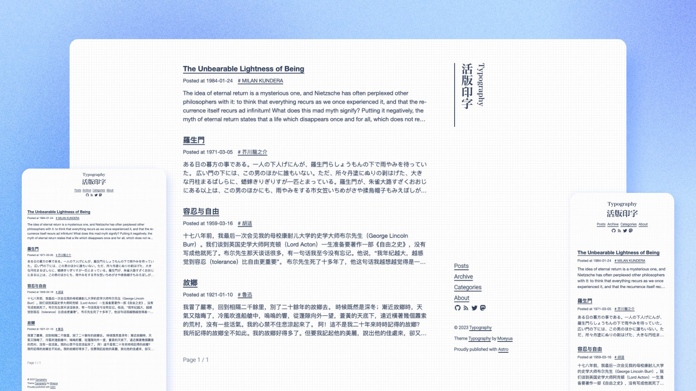

# Typography

<p align='center'>
  
</p>

<h6 align='center'>
<a href="https://astro-theme-typography.vercel.app/">Live Demo</a>
</h6>
<h5 align='center'>
<b>This work is rewrite from <a href="https://github.com/sumimakito/hexo-theme-typography">hexo-theme-Typography</a></b>
</h5>
<p align='center'>
<b>English</b> | <a href="./README.zh-CN.md">简体中文</a>
</p>

## Features

- Build with **Astro**, **TypeScript** and **UnoCSS**
- **Fast**. 100% [Pagespeed Score](https://pagespeed.web.dev/analysis/https-astro-theme-typography-vercel-app/j34nq9tx0s?form_factor=desktop).
- **Typography** Derived from prevalent Chinese typographic norms and aims to provide an enhanced reading experience for website visitors.
- **Responsive**. Responsive and works well on all screen sizes.
- **Accessible**. A well thought out semantic and accessible content.
- **SEO friendly**.Open Graph and Twitter Cards support for a better social sharing experience.
- **Sitemap** and **RSS feed** for search engines.
- i18n support.
- Support Disqus, Giscus, Twikoo as comment service.
- Dark mode support.

## Demo

> Submit a PR to add your blog Demo.

- [Live Demo](https://astro-theme-typography.vercel.app/)
- [My Blog](https://blog.moeyua.com/)
- [Julyfun's Blog (how to fully build this blog using `bun` in minutes)](https://julyfun.fun/posts/%E5%85%89%E9%80%9F%E6%90%AD%E5%BB%BA%E8%BF%99%E6%A0%B7%E4%B8%80%E4%B8%AA%E5%8D%9A%E5%AE%A2/)
- [Jinx's Blog](https://blog.mytest.cc/)
- [Unconventional Reading Notes](https://books.beyondxin.top/)

## Getting Started

Typography is a minimal, responsive and SEO-friendly Astro blog theme. This guide will help you get started with a new project.

### Quick Start

You can fork the repository to your account by clicking the Fork button in the upper right corner, click the button below, select the repository you just forked, click the Import button, and you will be taken to the project configuration page.

[](https://vercel.com/new)
[](https://app.netlify.com/start)

Or you can refer to the [Astro](https://docs.astro.build/guides/deploy/) documentation to deploy to your favorite platform.

### Add post

You can add content by creating a new markdown file in `src/content/posts`. The file need metadata in the frontmatter, like this:

```md
---
title: title
pubDate: 2021-08-01
categories: ["article"]
description: "description"
---
```

Or, you can use the following command in your terminal to create a new post:

```bash
pnpm theme:create
```

## Updating the theme

You can simply [`Sync Fork`](https://docs.github.com/en/pull-requests/collaborating-with-pull-requests/working-with-forks/syncing-a-fork) on your own forked project (do not click Discard Changes, otherwise you will lose your own changes).

## Customization

Typography is highly customizable. The default configuration file is [src/.config/default.ts](src/.config/default.ts), you can override the default configuration in [src/.config/user.ts](src/.config/user.ts) as needed.

### Social links

Typography has built-in support for adding links to your social media accounts to the site via the social option in the config file:

```ts
socials: [
  {
    name: 'github',
    href: 'https://github.com/moeyua/astro-theme-typography'
  }
]
```

The `name` is the icon name in [Material Design Icons](https://pictogrammers.com/library/mdi/),
which will be automatically generated as the icon.

> Note that you need to restart the development server to see the changes.

### Navigation links

By default, the navigation are `Posts`, `Archive`, `Categories` and `About`. You can add more in the config file:

```ts
{
  navs: [
    {
      name: 'Categories',
      href: '/categories'
    }
  ]
}
```

And then add the corresponding page in `src/pages`, see more in [Astro Pages](https://docs.astro.build/en/core-concepts/astro-pages/)

### Dark mode

Typography supports dark mode. You can change it in the config file:

```ts
themeStyle: 'dark' // 'light' | 'dark' | 'system'
```

### Internationalization (i18n)

Typography provides built-in support for multilingual sites. By default, the language is `en-us`, you can change it in the config file:

```ts
locale: 'zh-cn'
```

For now, Typography supports below languages:

- `en-us`
- `zh-cn`
- `zh-tw`
- `ja-jp`
- `it-it`

You can see all supported languages in [src/i18n.ts](src/i18n.ts), and add more if you need.

### Comment

Typography supports multiple comment services, currently supports [Disqus](https://disqus.com/), [Giscus](https://giscus.app/) and [Twikoo](https://twikoo.js.org/).

Enable the corresponding comment service by adding the configuration to the config file, when you fill in multiple comment services, only the first service will be displayed.

#### Disqus

You can enable Disqus by adding the following configuration to the config file:

```ts
comments: {
  disqus: {
    shortname: 'your-disqus-shortname'
  }
}
```

#### Giscus

Based on the [Giscus web component](https://github.com/giscus/giscus-component?tab=readme-ov-file#using-the-web-component) implementation.

The prop names are the same as the data- attributes shown on the [giscus website](<(https://giscus.app/)>), but written in camelCase with the data- prefix and dashes removed.

You can enable Giscus by adding the following configuration to the config file:

```ts
{
  comments: {
    giscus: {
      repo: 'moeyua/astro-theme-typography'
      repoId: 'R_kgDOKy9HOQ'
      category: 'General'
      categoryId: 'DIC_kwDOKy9HOc4CegmW'
      mapping: 'title'
      strict: '0'
      reactionsEnabled: '1'
      emitMetadata: '1'
      inputPosition: 'top'
      theme: 'light'
      lang: 'zh-CN'
      loading: 'lazy'
    }
  }
}
```

#### Twikoo

You can enable Twikoo by adding the following configuration to the config file:

```ts
{
  comments: {
    twikoo: {
      envId: 'your-env-id'
    }
  }
}
```

## Pagespeed Score

[](https://pagespeed.web.dev/analysis/https-astro-theme-typography-vercel-app/j34nq9tx0s?form_factor=desktop)

## TODO

- [ ] WebSub
- [x] comment
- [ ] search
- [ ] analytics
