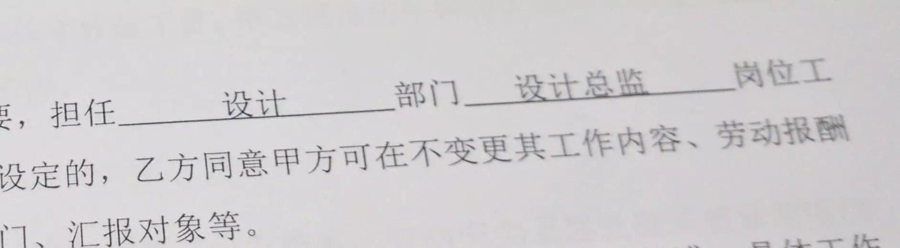

偏偏做梦也想不到的是，我也会有 25 岁的一天。

是的，要从来到这里时算起，我确确实实度过了世间的 25 个年头。

从普世价值来看，到目前为止我应是算作失败者里面。
<!--more-->
你看，我自幼喜静，无甚成绩，相貌平平，目不识丁，语不惊人，文不对题，歌不能入耳，音不可对律。
恋爱会失败，做事遇障碍。

指不出有哪一点在闪光。

我想你从第一个字开始时，就在等着这一着。
看吧，即使在这里，我也免不了俗套要来个转折，就像你料想的一样。
可见是多么的失败啊。

唯一让我安慰的是，我的转折却不是一百八十度的辩解，它是平的，是沿着先前的设定前进的接受。

首先抛出的是一个问题。

你认为，什么是成功？

恕我直白，当你试图从嘴里说出你的成功并要他人接受时，情况已经反转成你是失败者了。因为你试图用自有的价值尺度去量仗拥有不同尺度的他人且试图让人接受，这注定了，是要失败的。就好似，用厘米和千克去作比较一般。

所以，就算我有失偏颇，跳脱出普世价值，作为一个体验者。自认是朝向成功的，这一切我所拥有和经历过的点滴，都为现今的我。就算作我的自大，久而久之，冥冥有感，自我胸中明了与思辨的事物该是比多数同龄甚至长者也多。

当然，我话虽是激进，不过我想正在看这些的朋友你，该是会明白我的用意。

我始终感激我的父母。
从他们身上，我继承了很多。

自由意志以及温柔。

从前我几乎只把注意力放在了自由意志对我造成的影响，而忽视了温柔这一元素。

猛地一暼，却惊觉其中门道难觅。

可别小瞧了温柔。
这个新鲜的视点我自己倒第一次摸到。

是的，我想，温柔确实是学不来的，因为它总是被镌刻在了一个人深层的性情当中。
除非是改变性情，可这谈何容易。
即使通过如此方式也只能说是习得而非学得。

习和学有何差异？

学，很简单，依样画葫芦。

习，反复练习，却是在不变的定式中，去体会真意，那种你甚至无法以言语诉说的意。

所以，单单看一个人假装出来的温柔，不论你懂不懂，也是能轻易明了百出的破绽。因为这样的假装，是根本感受不到一些极其微妙却又至关重要的细节。

推陈开来，这也说得通我那天生的敏感了。就像“学习”一词也要分开来看，才能明了它究竟是讲的什么意思。就两个字，就已经把它们要教给我们的真理和方法展现得淋漓尽致了。

是的，温柔往往与一个人对于周遭的敏感程度挂钩的。因为敏感，你才感受到细节，因为感受到了细节你才能处理细节，因为处理了细节别人才感觉到细腻，因为别人感觉到细腻才能感觉到温柔。
以我浅显的以为，大抵是如此的。

聊聊我 25 岁的现状吧。

肄业，是的，我是一名肄业生。我在大三时作出的退学的决定。这可能是让绝大多数认识我的以及亲人们人大跌眼镜的，毕竟一直以来我给的印象总让大家以为我就是那个乖乖，按部就班是顺理成章的事。很抱歉，墨守陈规这种看起来符合我的东西，实际上却是同我的理念有异，这是从很早以前就埋下的种子。我想或许我可以去当个演员，因为在这之前，我似乎都表演得挺好，哈哈，开个玩笑。
这是我第一次公开这个事实，在这之前，只有我父亲以及极少的同学朋友知道。掩藏至今是因为我得考虑到亲友舆论对于家庭和认知差异的冲击及其后果。显然，现在时候已然成熟。

究其原因，大概是因为我是一个实用主义者，学业里我看不到令我感兴趣的闪光点，所以最初构想是自己干，以捕获当时各大高校的某项供应为目标，就算是现在的市场当量，我当初的构思里，即使现在看来很粗糙，似乎仍未见有人真正的去吃那块肥肉。

当然，至于何以胎死腹中，我不细谈。

说真的，跑退学的程序真是麻烦死了。

在这中间空白的里，我淌过地狱——抑郁。那一幕的演出，在我的一生中可能都是最恐怖的，同时可能也是最富有的。

或许你从来也没有在将来也不会体验过在饥荒年代里，人们会饿成什么样子，那是什么样的感受。我体验过。

或许你从来也没有在将来也不会体验过一个人的欲望被压抑到冰点是什么样的感受。我体验过。

或许你从来也没有在将来也不会体验过一个人能孤独到感觉同这个世界毫不相干，多一个少一个没所谓活着同死去一样是什么样的感受。我体验过。

…

太多说不完也想不起完。

绝望和崩溃的边缘，我那惊人的韧性再次起到至关之用。那期间我修补了许多我从前未曾指染过的或不完整东西。在表面平静却内里激烈的抗争过后。我想，至少从思想上我是收获丰盈的。虽然看起来我也只是损失过大量体重，可实际的代价唯有经历过的人才知其间惨烈，不可描述。

只愿各位都健康平安。

待业，是的，我现在待业，在离开我人生中第一份正式工作到现在，我休息了快 4 个月了。

或许我这一生还有许许多多的未知。好不困难一步步吃力地爬向深渊边缘，我发过拙作，有幸受过人们注意。

深圳对于第一份工作有些远，对于未曾痊愈也不可能痊愈的我来说，不想在准备好前立刻就被拖入另一个深渊。所以未给反应。

旧金山，虽说美国在从前就一直是我向往之地，可当时刚完成异常严重的内耗，马上要投入新的挑战几乎不可取，深圳不可，湾区亦不可。

再后来就是在成都，因为就近。比较符合预期，所以在先前对方主动找到我邮件交流后头天电话联系第二天面谈第三天就签合同开始工作，在找上我时，他们手里压了有 400 份设计师的简历，所以说思想的威力在闪光了。

是的，这是我的第一份工作。创业公司，互联网，app，做安卓手机的启动器，基于启动器未来布局面向广告，应用分发等。

初创公司嘛，微型团队，头衔什么的无所谓，正反都是一个人顶十个人，相关甚至不相关领域，什么都干，工作量巨大。而我也从一开始就异常的拼。加班，通宵，手到擒来。期间每一天都面临着新的挑战。挑战之于我，其实并无大碍，也就是掌握新的知识和技能，解决新的问题，自觉在行，有时甚至附带有趣。

可一开始学走路，谁都有摔跤时候。创业嘛，因为是启动器，且产品规划对于技术的可行性要求偏高，所以即使一直在招开发人员却始终找不到合格的人选(是的，是合格不是合适这让我体会到了，其实不努力的人还有太多太多)，所以只得选择技术外包，可带来的问题是沟通成本巨大(其实这完全是可避免的，无奈对方确实极难沟通，连我这种脾气的都焦灼)，天天撕逼…

另内部需求一直改动，流程混乱，外加我自身本身是同时面临这些压力外加新挑战。所以在所有综合因素下，我的负担极其严重。久而久之，除却肉体，我的精神也开始被蚕食。

逐渐的，毕竟高强度不可久为，我的状态开始糟糕起来，公司见状也和我提加薪以缓和，可我未有接受，我告之道，“不是钱的问题。”并又说明了一下我们当时遇到的种种以及这些种种给我的工作量及压力加了多少砝码，可即使讨论后，我们仍清楚，在当时一切都是没有办法的事，毕竟现金流还得考虑后续的事。

此后我仍是坚持，可因为长期的急行军，我逐渐感受到自己又在迈入另一个深渊，而造成这些后果的压力，公司其实一开始就可以避免的。可我也知道 CEO 大哥待我不薄，所以也不曾想过推之即去，这并无道义。

所以最终在完成所有需要设计方面完成的必须资源后，在压力重压下即使是身体都快要坏掉的时候，在那个周日和家父通过电话诉说过情况后，在第二天发觉自己没法从床上起来后。

我就未曾在公司出现过。

我用微信第一次叫了 CEO 一声哥并说明了缘由，为了为他们打气，我最后一个月薪水也是放弃了的。哪怕在我真正融入某个团队前要我称兄道弟会让我觉得异常别扭，但是出于我的敬佩，我还是说了，我知道他们很强，我也知道大家待我如兄弟，可我是有自己的底线，我是绝对不会选择用自己的健康来换取报酬的，这是在很早之前我就明确过的一件事。

因为是成年人，所以我拥有选择的权利，就像所有人也拥有一样。

况且设计，虽说不完全是创造性的工作，可仍是有这样成分，而高压对于这来说是异常不利的。我不可能放弃自己未来的可能性。

在那之后，我一个人在房间里喝了整整一个月闷酒卸压，是的，我又多了一份新体验，直到我看到酒就反胃…

所以，即使要我再来一次，即使公司未来真的发展壮大我可能成为元老，面对相同的情况，我仍然会毫不犹豫的在适时选择退出，因为，于我而言，这才是明智的，不让自己后悔的选择。

金钱，名声，于我皆是在外，只是附带。

毕竟在我的观念中，我和公司本就是一种合作关系，且事实本就如此。

最近无意间在谷歌商店发现自己做的东西在公测了，倒是欣喜，无论如何，这里面也是蕴含了自己大量心血，更不必提 4 个月间掉的十几二十斤体重。

愿你们一切顺利。

关于将来。

将来就是很快便会来了。

我也不担心自己今后的脚步会走向何处。不过很快我大概又会经历人生第一次投出简历吧。

他从不担心自己被人群淹没…

我妈可能会增强“你耍朋友了没得啊？！”的频次来刺探我的隐私，哈哈哈。

该争取的争取，是随缘的随缘…

至此，我要特别感谢一路给予我支持的兄弟，在最灰暗的岁月里，没有你们的哪怕只言片语，我可能撑不到今天。说你呢，笑什么笑。

另还有睡在我上铺的兄弟掌握着核心科技，不对，是我的黑历史，想想都害怕，唔～唔～唔～唔～唔…

感觉后面写的有些乱，毕竟又熬夜到四点了，回家了还是想早一分入梦。

至此打住，希望字间藏匿能给予你一分启发，毕竟公开发出除却记录，亦是为寻交流。

偏偏做梦也想不到，我也有 25 岁的一日。

其实久而久之，这般不闻不问，每到生日，却是些许落寞。

习惯多了之后，甚是心酸…

左顾右盼，
也只好祝我生日快乐。

睡罢
