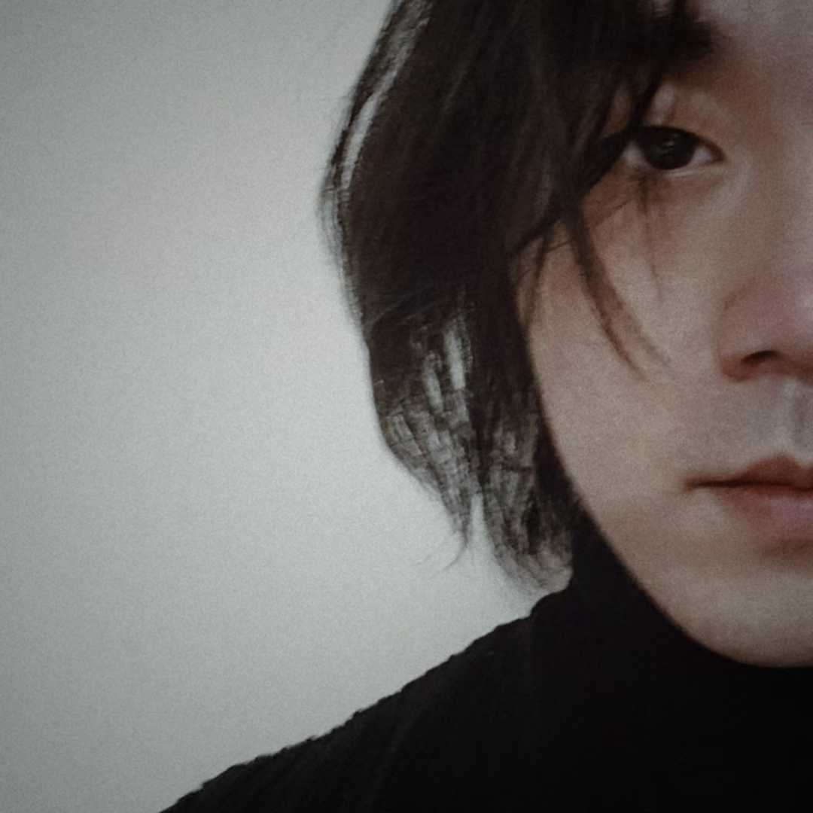

对面的我凝视着我。

问我，

“我有多久没哭过了？”

大抵有多久没哭出来过，感性就被压在行囊底多实。

我想我不可再继续向前。

我应停下，生一堆火，坐下来，摊开细软，解一解领扣，和自己面对面。

我问，

“我是个怎样的人，要做怎样的人？”

真诚，纯粹，专注，优雅，四个象限在罗盘是否仍能看清？

勇气的形式有疾风骤雨，是冲动。
勇气的形式有古井无波，是冷静。
少一个，不完整。

问我，

我问，
......

对话必须持续，直到我哭出来。

把哭不出来的自己弄哭，不简单。

于  镜子前

二零二五年 一月 廿二日